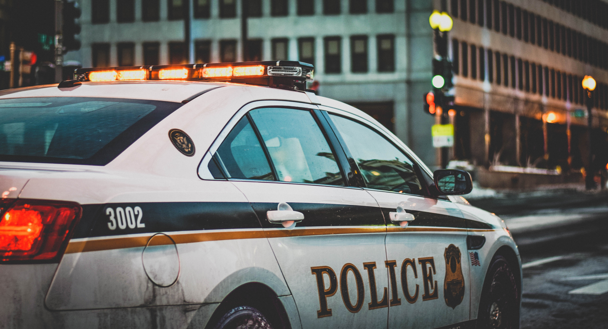

# Denver Crime Analysis

Currently collecting all revelant datasets:
- Denver Crime Dataset - [Denver Open Data Catalog](https://www.denvergov.org/opendata/dataset/city-and-county-of-denver-crime)
- Aurora Crime Dataset - [City of Aurora Open Data](http://data-auroraco.opendata.arcgis.com/datasets/crime-and-traffic-incident-data-10-years?geometry=-105.261%2C39.492%2C-104.139%2C39.862)

***

*Photo by Matt Popovich on Unsplash* 